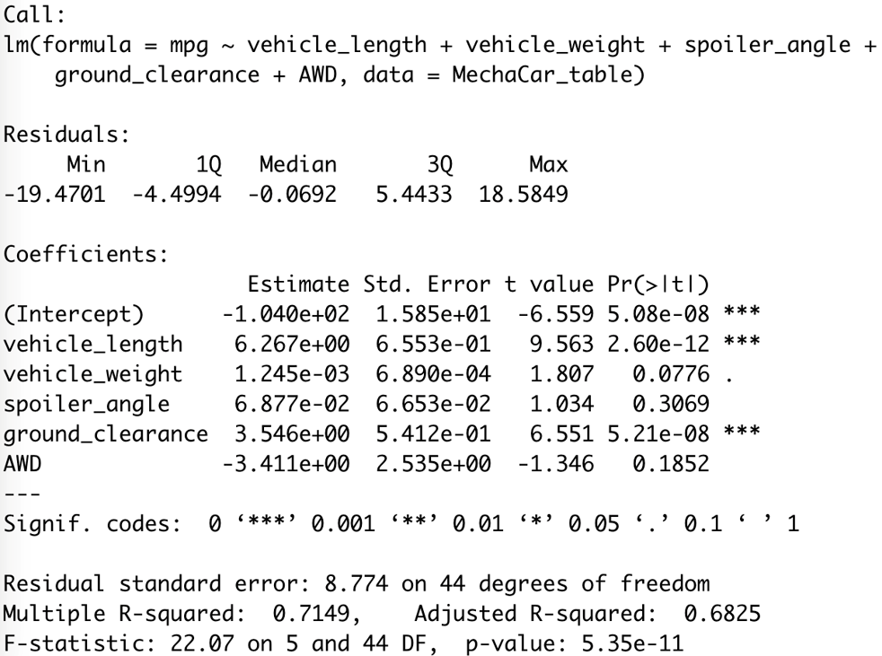
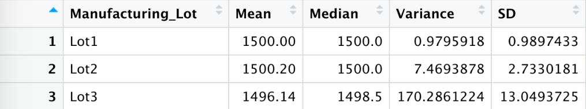
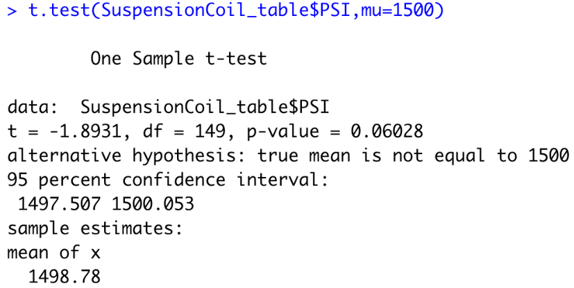
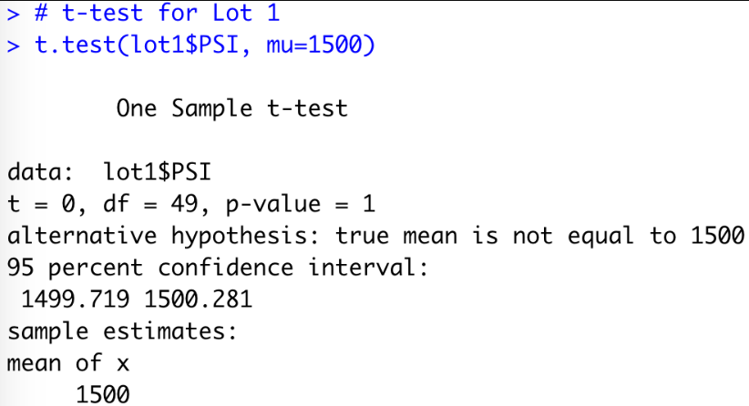
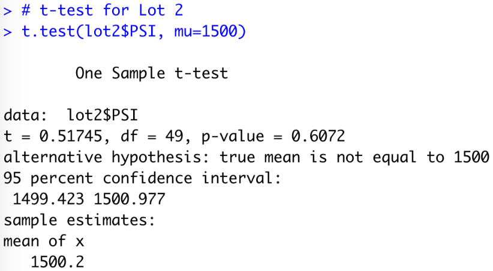
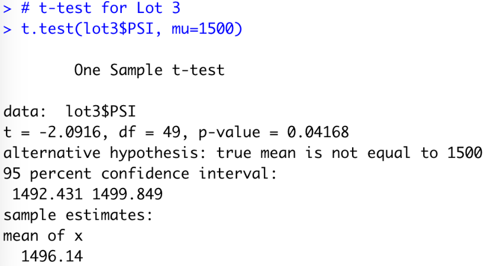

# MechaCar_Statistical_Analysis

## Linear Regression to Predict MPG

We will use the following methodology and using the summary data returned from our code (pictured below) to perform the analysis and address the questions presented. The focus is on Linear Regression to Predict MPG Performed to identify which variables in the dataset predict the mpg of MechaCar prototypes.

1. Each Pr(>|t|) value in the summary data represents the probability that each coefficient contributes a random amount of variance to the linear model.

2. Examine the Pr(>|t|) value in the summary data for the Intercept.

3. Examine the Multiple R-squared value to indicate how well the regression model approximates real-world data points. In most cases, the value will range between 0 and 1 and can be used as probability metric to determine the likelihood that future data points will fit the model.

### Which variables/coefficients provided a non-random amount of variance to the mpg values in the dataset?

With the p value of 0.05 as a standard of having a significance to the dataset, we see that the vehicle length (p value = 5.08e-08) and vehicle ground clearance (p value = 5.21e-08) most likely provided a non-random amount of variance to the mpg values in the dataset. Variables such as vehicle weight, spoiler angle, and AWD are not statistically significant and are most likely due to a random amount of variance since their p-value is > .05.

### Is the slope of the linear model considered to be zero? Why or why not?

The slopes of the variables are considered to be non-zero since the p-value for this model is p-value: 5.35e-11 - which is much smaller than our assumed significance level of 0.05%. Therefore, we can state that there is sufficient evidence to reject our null hypothesis - meaning the slope of our linear model is not zero.

### Does this linear model predict mpg of MechaCar prototypes effectively? Why or why not?

The R-squared value of this model is 0.7149, which means that approximately 71.5% of this models predictions will fall on the linear regression model equation's line. This means that this linear model predicts mpg of MechaCar prototypes effectively.

## Summary Statistics on Suspension Coils

We will use the following methodology and using the summary data returned from our code (pictured below) to perform the analysis and address the question presented. The focus is on Summary Statistics on Suspension Coils statistics on the pounds per square inch (PSI) of the suspension coils from the manufacturing lots.

1. Examine the mean, median and variance in total (total_summary) to determine if the variance is within the 100 pounds per square inch.

### The design specifications for the MechaCar suspension coils dictate that the variance of the suspension coils must not exceed 100 pounds per square inch. Does the current manufacturing data meet this design specification for all manufacturing lots in total and each lot individually? Why or why not?

In total the specification are met with variance of 62.29 (less than 100). By Lots, Lots 1 & 2 are within specifications; however Lot 3 has a variance that exceeds specifications (100 PSI).

## T-Tests on Suspension Coils

We will use the following methodology and using the summary data returned from our code (pictured below) to perform the analysis and address the questions presented. The focus is T-Test on Suspension Coils to determine if the manufacturing lots are statistically different from the mean population.

1. Perform a t.test using PSI and muof 1500 and evaluate the resulting p-value for significance using a .05 level of significance.

### Summary Analysis

* All Lots are not significantly different from the population mean (with a p-value of 0.060).
* Lot 1 is not significantly different from the population mean(with a p-value of 1)
* Lot 2 is not significantly different from the population mean (with a p-value of 0.61)
* Lot 3 is significantly different from the population mean (with a p-value of 0.042)

## Study Design: MechaCar vs Competition

### What metric or metrics are you going to test?

Mechanical failure and performance degradation. 

### What statistical test would you use to test the hypothesis? And why?

A linear regression test could be used to test this hypothesis to see if there is a correlation / relationsip between the two variables. If there is a significant linear relationship, we could also predict the mechanical failure from performance degradation.

### What data is needed to run the statistical test?

In order to perform this statistical test, we would need a dataset to include the time when noticable perfomance loss and the time of mechanical failure on the MechaCars.
